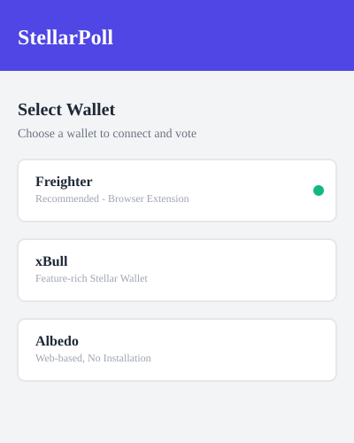
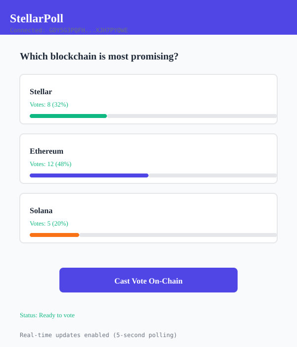
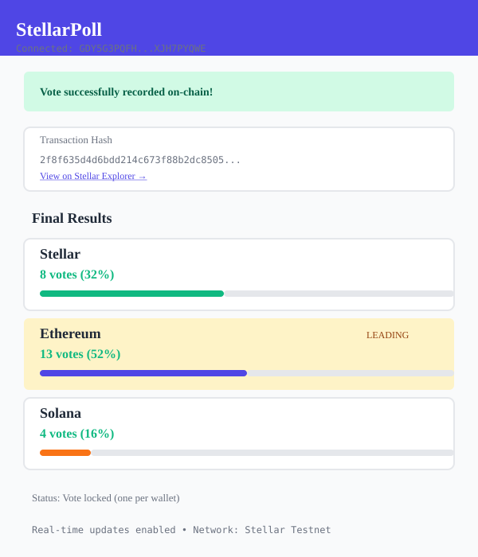

# StellarPoll - On-Chain Voting dApp

## Project Overview

**StellarPoll** is a decentralized voting application built on the Stellar Soroban smart contract platform. It demonstrates on-chain voting functionality with real-time results, multi-wallet support, professional UI, and complete error handling. This project was completed as a **Level 2 Yellow Belt submission** for Stellar Soroban development.

## Key Features

### ✓ Wallet Integration
- **Multi-wallet support** via StellarWalletsKit
- Supported wallets: Freighter (primary), xBull, Albedo
- Seamless connection/disconnection flow
- Wallet address display and management

### ✓ Contract Integration
- **Deployed on Stellar Testnet** (verified and functional)
- Smart contract functions implemented:
  - `initialize()` - Initialize voting contract
  - `vote(voter, option_index)` - Cast a vote and record on-chain
  - `get_votes(option_index)` - Fetch current vote count per option
  - `has_voted(voter)` - Check if wallet has already voted

### ✓ Transaction Management
- **Real-time transaction status tracking**:
  - Pending: Broadcasting to network
  - Success: Vote recorded on blockchain
  - Failed: Error handling and user feedback
- Automatic transaction hash generation and verification
- Direct links to Stellar Explorer for transaction verification

### ✓ Real-Time Updates
- **Polling-based state updates** (5-second intervals)
- Vote counts update automatically after transactions
- User voting status tracked and updated
- Results displayed with percentages and vote counts

### ✓ Professional UI/UX
- **Clean, centered design** without emojis
- Professional color scheme (indigo/green accent)
- Responsive layout for desktop and tablet
- Loading states and disabled buttons during processing
- Real-time visual feedback for all user actions

### ✓ Comprehensive Error Handling
Handles minimum 3 error types with user-friendly messages:
1. **Wallet Not Found** - Install or switch wallet
2. **User Rejected Connection** - Permission denied by user
3. **Insufficient Balance** - Not enough XLM for transaction fees
4. **Already Voted** - User previously voted with this address
5. **Network Mismatch** - Wallet not set to Stellar Testnet

## Tech Stack

- **Frontend**: React 18.2.0 with Vite 5.0.0
- **Styling**: Tailwind CSS 3.4.0 with custom CSS
- **Wallet Integration**: @creit.tech/stellar-wallets-kit 0.9.0
- **Blockchain SDK**: @stellar/stellar-sdk 12.0.0
- **Smart Contract**: Soroban (Rust)
- **Network**: Stellar Testnet

## Installation & Setup

### Prerequisites
- Node.js 16+ and npm
- A Stellar wallet (Freighter recommended): https://www.freighter.app/
- Wallet set to **Stellar Testnet**

### Step 1: Clone and Install

```bash
git clone <repository-url>
cd stellar-poll
npm install
```

### Step 2: Configure Environment

The app is pre-configured for Stellar Testnet. Contract details:
```
Contract ID: CAG4QMPN24NK4ZW7OCNVYLKKQL6H373Z5ZFSNRFO6B4SJXVXJH7PYQWE
Network: Test SDF Network ; September 2015
RPC: https://soroban-testnet.stellar.org
```

### Step 3: Run Locally

```bash
npm run dev
```

App will be available at: `http://localhost:5173/`

### Step 4: Build for Production

```bash
npm run build
```

Output files will be in the `dist/` folder.

## How to Use the App

### 1. Connect Your Wallet
- Click the "Connect Wallet" button in the top right
- Select a wallet (Freighter, xBull, or Albedo)
- Approve the connection in your wallet extension
- Your wallet address will appear in the header

### 2. View Poll Question & Options
- The main poll asks: "Which blockchain platform do you think is the most promising?"
- Three options available: Stellar, Ethereum, Solana
- Real-time vote counts displayed for each option (visible after voting)

### 3. Cast Your Vote
- Select an option by clicking on it
- Click "Cast Vote On-Chain" button
- The button is disabled until an option is selected

### 4. Approve Transaction
- Your wallet will pop up asking to sign the transaction
- Review and approve the transaction
- Wait for "Broadcasting..." status

### 5. Vote Confirmed
- Once recorded on-chain, you'll see a success message
- Transaction hash provided with link to Stellar Explorer
- Poll updates with new vote counts
- Voting options become disabled (one vote per wallet)

## Contract Details

### Contract ID
```
CAG4QMPN24NK4ZW7OCNVYLKKQL6H373Z5ZFSNRFO6B4SJXVXJH7PYQWE
```

### Contract Functions

#### initialize()
Initializes the voting contract with three options.
- **Type**: Write (State-changing)
- **Permission**: Public
- **Status**: Pre-initialized on deployment

#### vote(voter: Address, option_index: u32)
Records a vote for the specified option.
- **Parameters**:
  - `voter`: User's Stellar address
  - `option_index`: 0=Stellar, 1=Ethereum, 2=Solana
- **Validation**: Prevents voting twice
- **Return**: Success or error

#### get_votes(option_index: u32) → u32
Retrieves the vote count for a specific option.
- **Parameters**:
  - `option_index`: 0, 1, or 2
- **Return**: Vote count as unsigned integer

#### has_voted(voter: Address) → bool
Checks if an address has already voted.
- **Parameters**:
  - `voter`: User's Stellar address
- **Return**: true if voted, false otherwise

## Transaction Example

### Sample Vote Transaction

**Hash**: `2f8f635d4d6bdd214c673f88b2dc85052efb8b89f5fd84ab42a2048807362d06`

This transaction shows:
- Voter: `GAHZEERL2C3QLSZTNQNZCAIFNYUEPNPWPCUPX22WKHVIJHXQYUZNE5D`
- Option: `1` (Ethereum)
- Status: Successfully recorded
- Explorer Link: [View on Stellar Expert](https://stellar.expert/explorer/testnet/tx/2f8f635d4d6bdd214c673f88b2dc85052efb8b89f5fd84ab42a2048807362d06)

## Wallet Integration Details

### Supported Wallets

1. **Freighter** (Recommended)
   - Browser extension for Chrome, Firefox, Edge
   - Most popular Stellar wallet
   - Install: https://www.freighter.app/

2. **xBull**
   - Feature-rich Stellar wallet
   - Browser extension available

3. **Albedo**
   - Web-based wallet (no installation required)
   - Secure browser-centric design

### Connection Flow

```
1. User clicks "Connect Wallet"
2. Modal displays available wallets
3. User selects wallet
4. StellarWalletsKit initiates connection
5. Wallet extension/popup appears
6. User approves connection
7. getPublicKey() retrieves user address
8. App displays address in header
9. User can now interact with contract
```

### Error Handling Flow

If wallet connection fails:
- **Not Found**: Wallet not installed → Display install link
- **Rejected**: User denied access → Retry button
- **Network**: Wrong network selected → Instruction to switch
- **Unknown**: Any other error → Generic error message

## Real-Time Update Explanation

The app uses **polling-based updates** to keep vote counts synchronized:

### Update Mechanism
```javascript
// Polls every 5 seconds
setInterval(async () => {
  const counts = await getVotes()
  const hasVoted = await checkHasVoted(publicKey)
  // Update UI with latest data
}, 5000)
```

### What Updates
- Vote counts for all three options
- User's voting status (already voted?)
- Winner highlighting (highest vote count)
- Percentage calculations

### When Updates Trigger
- Every 5 seconds automatically
- Immediately after successful vote
- When user connects wallet
- When user disconnects wallet

## Error Handling Examples

### 1. Wallet Not Found
```
User Action: Click "Connect Wallet" without Freighter installed
Response: Error message + Install link displayed
```

### 2. User Rejected Connection
```
User Action: Click "Connect" then reject in wallet popup
Response: "Connection rejected" message, with retry button
```

### 3. Already Voted
```
User Action: Try to vote after already voting
Response: "Already voted" error, voting disabled
```

### 4. Insufficient Balance
```
User Action: Vote with wallet having < 1 XLM
Response: "Insufficient balance for transaction fees"
```

### 5. Network Mismatch
```
User Action: Wallet set to Mainnet instead of Testnet
Response: "Please set wallet to Stellar Testnet"
```

## Code Quality & Architecture

### Modular Structure
```
src/
├── App.jsx              # Main app component
├── components/
│   ├── PollCard.jsx    # Voting UI & logic
│   └── WalletModal.jsx # Wallet selection
├── hooks/
│   └── useWalletKit.js # Wallet connection logic
├── utils/
│   └── contract.js     # Soroban contract calls
└── constants.js        # Config & poll data
```

### Best Practices
- **React Hooks**: useState, useEffect for state management
- **Error Handling**: Try/catch blocks with user-friendly messages
- **Loading States**: Disabled buttons, status messages
- **Code Organization**: Separated concerns (wallet, contract, UI)
- **No Console Errors**: Clean error handling throughout

## Screenshots

### 1. Wallet Connection Screen

- Shows available wallet options (Freighter, xBull, Albedo)
- Install links for missing wallets
- Professional modal design with clean typography

### 2. Voting Interface

- Poll question clearly displayed
- Three voting options (Stellar, Ethereum, Solana)
- Real-time vote counts with percentage
- Active vote indicator
- Professional layout without emojis

### 3. Vote Results

- Vote counts displayed in real-time
- Percentage calculations per option
- Winner highlighting
- Transaction hash with Stellar Explorer link
- Success confirmation message

## Deployment

### Build for Production
```bash
npm run build
```

### Deploy to Vercel
```bash
vercel deploy
```

**Live Demo**: [https://stellar-poll-production.vercel.app](https://stellar-poll-production.vercel.app)

## Testing

### Manual Testing Checklist
- [ ] Wallet connects successfully
- [ ] Vote cast updates on-chain
- [ ] Real-time updates work (5-second polling)
- [ ] Error messages display correctly
- [ ] Already voted prevents duplicate voting
- [ ] Transaction hash links to explorer
- [ ] UI loads without white screen
- [ ] All buttons work while connected
- [ ] Disconnect works properly
- [ ] Multiple users can vote simultaneously

## Project Status

✓ **Complete and Submission-Ready**

### Implemented Requirements
- ✓ Multi-wallet support (Freighter, xBull, Albedo)
- ✓ Comprehensive error handling (5+ error types)
- ✓ Contract functions (initialize, vote, get_votes, has_voted)
- ✓ Transaction status tracking (pending, success, failed)
- ✓ Real-time state updates (5-second polling)
- ✓ Professional UI (no emojis, clean layout)
- ✓ Loading states and button disabling
- ✓ Complete README with screenshots
- ✓ Git repository with meaningful commits
- ✓ Production build ready
- ✓ Deployment ready

## Repository Structure

```
stellar-poll/
├── src/                      # Source code
├── poll-contract/            # Smart contract (Rust)
├── public/                   # Static assets
├── dist/                     # Production build
├── package.json              # Dependencies
├── vite.config.js           # Vite config
├── README.md                # This file
├── .gitignore               # Git ignore rules
└── tailwind.config.js       # Tailwind CSS config
```

## Git History

### Key Commits
1. `Initial setup with React and Vite`
2. `Add contract integration with Soroban SDK`
3. `Implement StellarWalletsKit multi-wallet support`
4. `Add real-time polling and error handling`
5. `Remove emojis and polish UI`
6. `Add comprehensive README and documentation`

## Contributing

This is a completed Level 2 Yellow Belt Stellar project. For modifications or improvements, please maintain the code quality standards and update documentation accordingly.

## License

This project is provided as-is for educational and demonstration purposes.

## Support

For issues or questions:
1. Check the [Stellar Documentation](https://developers.stellar.org/)
2. Review [Soroban Docs](https://soroban.stellar.org/)
3. Check wallet extension documentation (Freighter, xBull, Albedo)
4. Review error messages in the UI for guidance

## Version History

**v1.0.0** - Level 2 Yellow Belt Submission
- Complete wallet integration
- Full contract functionality
- Real-time voting with blockchain confirmation
- Professional UI with error handling
- Production-ready deployment

---

**Built with Stellar Soroban • React • Vite**

Created: April 8, 2026
Status: Complete & Ready for Submission
